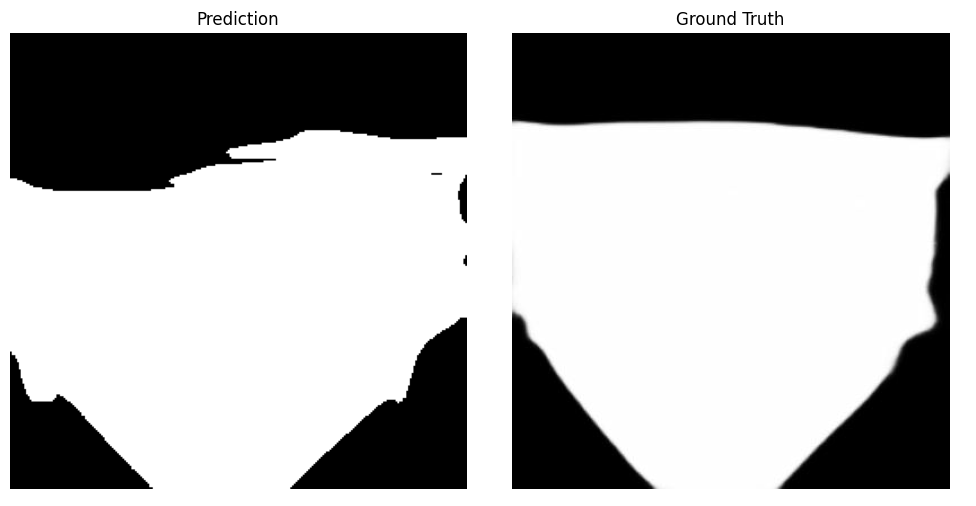

# Mask Image Classification

This project focuses on classifying images of people with and without masks using various machine learning and deep learning techniques.

## Features

- **Preprocessing Methods**:

  1. Histogram of Oriented Gradients (HOG)
  2. Local Binary Pattern (LBP)

- **Classification Models**:

  1. Support Vector Classifier (SVC)
  2. Neural Network
  3. Convolutional Neural Network (CNN)

- **Interactive Web Application**:
  - Built using Streamlit for uploading and classifying images.

## Installation

1. Clone the repository:

   ```bash
   git clone https://github.com/your-repo-url.git
   cd VR_MiniProject
   ```

2. Install dependencies

   ```bash
   pip install -r requirements.txt
   ```

3. Download and unzip data.zip from [Onedrive](https://iiitbac-my.sharepoint.com/:u:/g/personal/aditya_av_iiitb_ac_in/EUxRRsZsmudDrIHz4nx7HesBm-Xj-yOyzlSWY4wY_2JI4g?e=chbdnw) and copy it in /Data

4. Download and pickle files from [Onedrive](https://iiitbac-my.sharepoint.com/:f:/g/personal/aditya_av_iiitb_ac_in/Epv7QqiitO5IoX1KtSW_jgsBhERum67geqYB_z5KHvFsaw?e=NuVLsj) and place it in /model

5. To run

   ```bash
   streamlit run app.py
   ```

6. Results

   1. HOG with SVC

      

   2. LBP with SVC

      

   3. Nueral network with HOG Input

      

   4. CNN Results

      

# Mask Segmentation

## Mask Segmentation using Traditional Region based Segmentation

We implemented mask segmentation using traditional image processing techniques for region-based segmentation. 

The Canny edge detection algorithm was used to identify edges in the images, and the Watershed algorithm was applied using these edges as markers. This combination helped in accurately segmenting the masked regions from the background.

### Dataset
MFSD: Masked Face Segmentation Dataset for face-related tasks
[link](https://github.com/sadjadrz/MFSD?tab=readme-ov-file).


### Notebook
[Segmentation Notebook](./notebooks/segmentation.ipynb)


### Methodology

#### Preprocessing: Contrast Enhancement

To enhance image contrast, global methods such as linear stretching were unsuitable due to variations in lighting conditions, multiple light sources, shadows, and patterns across multiple images.

Therefore, we employed ***Contrast Limited Adaptive Histogram Equalization (CLAHE)*** for local contrast enhancement. 

CLAHE enhances local contrast by dividing the image into small, non-overlapping tiles and applying histogram equalization independently to each. To prevent noise over-amplification, it clips the histogram at a predefined threshold before computing the cumulative distribution function. The adjusted tiles are then merged using bilinear interpolation. 

This approach improves edge definition and is particularly effective for images with uneven lighting and complex patterns.

#### Edge Detection

For edge detection, we implemented the ***Canny Edge Detection*** algorithm, which produces one-pixel-wide edges through non-maximum suppression. This technique allows for precise localization of edges by identifying local maxima in the gradient magnitude.

The Canny algorithm employs a double thresholding mechanism to classify edge pixels into strong and weak categories, so you can have adaptive edge detection for each image using strong and weak edge thresholds, which ensures robustness of edge detection across varying lighting conditions and image content.

In our implementation, we  heuristically determined strong and weak edge thresholds to be 62 ,15 percentiles of pixel intensity respectively. 


<div align="center">
   
   <p>Canny Edge Detection </p>
</div>

#### Segmentation

In the context of region-based segmentation, techniques such as region growing were unsuitable due to their reliance on prior knowledge for seed point initialization.

Consequently, the **Watershed Segmentation** algorithm was used  to segment the mask.

The watershed is a classical algorithm used for segmentation, that is, for separating different objects in an image.

Starting from user-defined markers, the watershed algorithm treats pixels values as a local topography (elevation). The algorithm floods basins from the markers until basins attributed to different markers meet on watershed lines. In many cases, markers are chosen as local minima of the image, from which basins are flooded

<div align="center">
   
   <p>WaterShed Segmentation</p>
</div>

#### Automatic Mask Color Detection

In our application of the watershed algorithm for image segmentation, we utilized pixel intensity-based markers to delineate background, foreground, and sure foreground regions.

 This marker-based approach is effective in guiding the segmentation process by assigning labels to different regions based on local intensity gradients.

In our watershed implementation, the algorithm assumes the mask is lighter than the background. If the mask is darker, we detect and invert it by comparing the mean pixel intensities of the image’s lower and upper halves, assuming the mask predominantly occupies the lower half. If the lower half is darker, the image is inverted to ensure consistency.

To improve robustness, we analyze three concentric square regions (25%, 50%, and 75% of the image area), comparing top and bottom mean intensities. This multi-scale approach enhances accuracy in determining whether inversion is needed.x

<div align="center">
   
   <p>Concentric Squares For Mask Color Detection</p>
</div>


<div align="center">
    
    <p>Dark Mask Inversion Example</p>
</div>

#### Mask Segmentation
n our mask segmentation process, we assume that the largest non-background cluster represents the mask. 

This cluster is isolated, while all other regions are classified as background. This assumption ensures a consistent approach to segmentation, though its accuracy depends on the specific image characteristics.

<div align="center">
    
    <p>Mask Segmentation with IoU Score</p>
</div>

### Evaluation Metric 

#### IoU Score

Intersection over Union (IoU), also known as the **Jaccard Index**, is a standard metric for evaluating the accuracy of image segmentation models. It quantifies the overlap between the predicted segmentation mask and the ground truth mask, providing a measure of agreement.

**Mathematical Definition**

IoU is defined as the ratio of the area of **intersection** to the area of **union** between the predicted ($P$) and ground truth ($G$) masks:

$$
\text{IoU} = \frac{|P \cap G|}{|P \cup G|}
$$

In terms of pixel classification:

$$
\text{IoU} = \frac{\text{TP}}{\text{TP} + \text{FP} + \text{FN}}
$$

Where:
- **TP (True Positives):** Pixels correctly classified as part of the object.
- **FP (False Positives):** Pixels incorrectly classified as part of the object.
- **FN (False Negatives):** Object pixels missed by the model.

**Interpretation of IoU Scores**

- **IoU = 1.0** → Perfect segmentation (predicted mask perfectly overlaps ground truth).
- **IoU = 0.0** → No overlap between predicted and ground truth masks.
- **Higher IoU** → More accurate segmentation.


### Result
Test Set Size = **94 Images**
### IoU Score


 <table border="1" align="center">
    <tr>
        <th colspan="2">IoU Scores</th>
    </tr>
    <tr>
        <td><b>Mean IoU</b></td>
        <td>0.5366</td>
    </tr>
    <tr>
        <td><b>Median IoU</b></td>
        <td>0.5350</td>
    </tr>
</table>

### Analysis and Observation

Automatic segmentation is a challenging task, achieving a mean Intersection over Union (IoU) score of 0.5366 in our implemenation. 

Segmentation accuracy can be adversely affected by factors such as lighting variations, shadows, and patterned masks, which introduce complexities in accurately delineating object boundaries. 

Variations in lighting can cause uneven exposure, making it difficult to distinguish foreground from background. Shadows may create artificial edges that mislead segmentation algorithms, while complex patterns in masks can lead to incorrect region classification. 

Overcoming these challenges requires more robust preprocessing techniques and adaptive segmentation models.

### Running the Notebook

#### Requirements
- python - 3.12.8
- jupyterlab - 4.3.5
- matplotlib - 3.10.0
- opencv-python - 4.11.0.86
- numpy - 2.2.3
- scikit-learn - 1.6.1
- scikit-image - 0.25.2
- scipy - 1.15.2
- VSCode or similar jupyter enabled editor

#### How to Run
1. Install python version 3.12.8

2. Install jupyterlab 
   ```
   pip install jupyterlab
   ```
3. Clone the repository:

   ```bash
   git clone https://github.com/ADITYAAV80/VR_Project1_AdityaAV_MT2024009.git
   cd VR_Project1_AdityaAV_MT2024009
   ```

4. Download and unzip data.zip from [GDrive](https://drive.google.com/file/d/1KycQj4dik91RuBGvbhDJou7YDQEKAH2Z/view) and copy it in /Data

5. Run the Jupyter notebook in VSCode or Similar Editor
   ```
   Notebook path -> ./notebooks/segmentation.ipynb
   ```
   
   
   
# UNET Segmentation

### Hyper parameter tuning 
#### GridSearch 
There are other methods like bayesian optimization which can be used for hyper parameter tuning, but I used gridsearch
##### Search space
1. "learning_rate": [1e-3, 1e-4],
2. "dropout": [0.3, 0.5],
3. "num_filters": [32, 64],
4. "kernel_size": [(3,3), (5,5)]

The correspoding information regarding the models architecture  and their summary is there given in the hyper parameter tuning folder. 
Got an idea how the IoU score varies according to the architecture, which helped in building the final model. 
The IoU score of each model variant with respect to the data is jotted in the "results.csv", the above mentioned folder. 


## Result
### Train Size = **9383 Images**
#### Dice Score =  0.93 


### Test Set Size = **94 Images**
#### IoU Score


 <table border="1" align="center">
    <tr>
        <th colspan="2">IoU Scores</th>
    </tr>
    <tr>
        <td><b>Mean IoU</b></td>
        <td>0.80</td>
    </tr>
</table>

### Sample output prediction from model

#### Sample 1
<div align="center">
    
    <p>Comparision Ground Truth vs Predicted</p>
</div>

#### Sample 2
<div align="center">
    
    <p>Original vs Ground Truth vs Predcited </p>
</div>


## Comparision Between the Unet and Traditional model

### Descriptive statistics
<div align="center">
    
    <p>Description Comparision in IoU metric </p>
</div>


##### Box plot for IOU comparision
<div align="center">
    
    <p>Box plot compa in IoU metric </p>
</div>

##### Line plot for IOU comparision 
<div align="center">
    
    <p>Line Plot Comparision in IoU metric </p>
</div>

##### Histogram  for IOU comparision 
<div align="center">
    
    <p>Histogram  Comparision in IoU metric </p>
</div>


#### How to Run
1. Install python version 3.12.8

2. Install jupyterlab 
   ```
   pip install jupyterlab
   ```
3. Clone the repository:

   ```bash
   git clone https://github.com/ADITYAAV80/VR_Project1_AdityaAV_MT2024009.git
   cd VR_Project1_AdityaAV_MT2024009
   ```

4. Download the trained Unet model usig Kaggle from [GDrive](https://drive.google.com/drive/folders/1q_44WhV46XyMAx_moPTOOofJn8KzyL2j?usp=sharing) and copy it in /Data

5. Change the names of dataset(trained on kaggle). Then download the unet trained best model and make the use it locally.

6. Run the Jupyter notebook in VSCode or Similar Editor
   ```
   Notebook path -> ./notebooks/segmentation.ipynb
   ```
